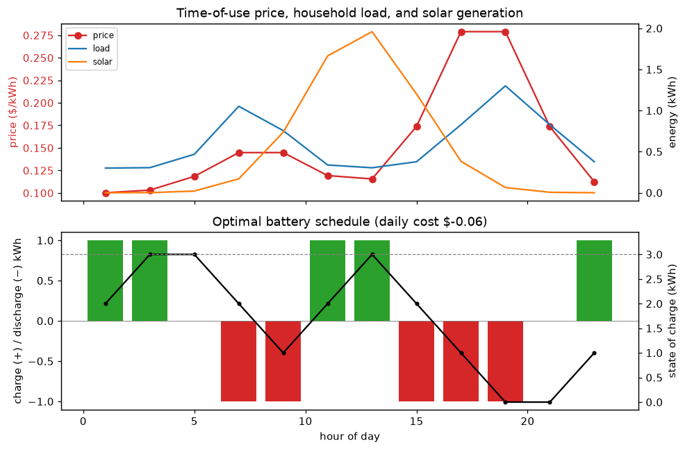

# quantum-solar

[](https://github.com/austinamissah/quantum-solar/actions/workflows/tests.yml)

Quantum optimization of **residential battery charge/discharge scheduling under
time-of-use electricity pricing**.

Given a day split into `T` time slots — each with a solar generation, household
load, and electricity price — decide when a home battery should charge, discharge,
or idle to minimize the electricity bill, subject to the battery's capacity and a
return-to-initial state-of-charge constraint. The schedule is expressed as a QUBO
and solved with QAOA on the Qiskit Aer simulator, verified against exact classical
baselines.

## Example schedule

The optimizer charges when energy is cheap (overnight and midday, when solar is
abundant) and discharges into the morning and evening price peaks, while keeping
the state of charge within capacity and returning it to its starting level:



*(Illustrative synthetic day; regenerate with `python scripts/make_preview.py`. See
[Real data](#real-data) for using real NREL solar generation.)*

## Pipeline

```
BatteryProblem ──build_qubo──▶ QUBO ──qubo_to_ising──▶ Ising H ──▶ QAOASolver ──▶ schedule
      │                          │                                                   ▲
      │                          └──▶ brute_force_solve (exact, tiny T) ─────────────┤ verify
      └──────────────────────────────▶ dp_solve (exact, polynomial, any T) ──────────┘
```

1. **`BatteryProblem`** owns the true objective (net-metered grid cost) and the
   hard constraints: no simultaneous charge/discharge, state of charge within
   `[0, Q]`, and `S_T = S_0`.
2. **`build_qubo`** folds the linear cost objective and the constraints into a
   QUBO. The state-of-charge inequality `0 ≤ S_t ≤ Q` is encoded **exactly** with
   a bounded binary *slack* variable per interior slot — `(S_t − s_t)²` is zero
   iff the SoC is in band. This is exact (so brute force stays a valid ground
   truth) at the cost of extra qubits.
3. **`qubo_to_ising`** maps the QUBO to a Qiskit `SparsePauliOp` cost Hamiltonian,
   with the invariant `⟨x|H|x⟩ + constant == qubo.energy(x)`.
4. **`QAOASolver`** runs QAOA on Aer (multi-start COBYLA over the variational
   parameters) and samples the best schedule.
5. **Verification.** `brute_force_solve` enumerates the QUBO exactly on tiny
   instances (validating the encoding); `dp_solve` is an exact `O(T·K·3)` dynamic
   program over the SoC grid that scales to a full day and serves as ground truth
   at larger `T`. Tests assert QAOA recovers the exact optimum.

v1 modeling assumptions: net metering (a single buy=sell price) and a lossless
battery with equal charge/discharge energy per slot. Asymmetric pricing and
round-trip losses are on the roadmap.

## Installation

```bash
git clone git@github.com:austinamissah/quantum-solar.git
cd quantum-solar
python -m venv .venv && source .venv/bin/activate
pip install -r requirements.txt   # qiskit, qiskit-aer, numpy, scipy, matplotlib, jupyter, pytest
pip install -e . --no-deps        # install the quantum_solar package (src layout)
```

## Run the demo

```bash
jupyter lab notebooks/demo.ipynb
```

The notebook builds a small instance, solves it with brute force, DP, and QAOA
(showing they agree), then plots the optimal schedule for a full day.

## Tests

```bash
pytest -m "not slow"   # fast unit tests (model, QUBO, Ising, brute force, DP)
pytest                 # full suite, including the slow Aer-backed QAOA runs
```

CI runs the fast suite on every push and pull request; a weekly scheduled job
runs the full suite including the slow quantum tests.

## Real data

Solar generation can be pulled from the NREL PVWatts API instead of the synthetic
generator:

```python
from quantum_solar.data import load_nrel_instance

problem = load_nrel_instance(lat=39.74, lon=-105.18, day=172)  # 24 hourly slots
```

Set `NREL_API_KEY` in your environment or a repo-root `.env` (a free key comes
from developer.nlr.gov). Responses are cached under `data/cache/`. Generation
(PVWatts) and the time-of-use price (Xcel Energy CO *Residential Energy TOU*,
Schedule RE-TOU, via URDB) are real; household load is still synthetic in v1 — an
EIA load loader is on the roadmap.

## Status

Working end-to-end in simulation: problem model, exact QUBO encoding, Ising
mapping, QAOA on Aer, and both classical baselines, all covered by tests. Solar
generation and time-of-use prices can use real NREL data (PVWatts + URDB);
household load remains synthetic.

## Roadmap

- **Real hardware run on IBM Quantum** — execute the QAOA circuits on a physical
  backend and compare against the simulator.
- Real household load loader (EIA) — solar generation (PVWatts) and time-of-use
  prices (URDB) are already wired up.
- Relax v1 assumptions: asymmetric buy/sell prices and round-trip efficiency.
- Scaling study: slack-free approximate encodings vs. the exact one.
