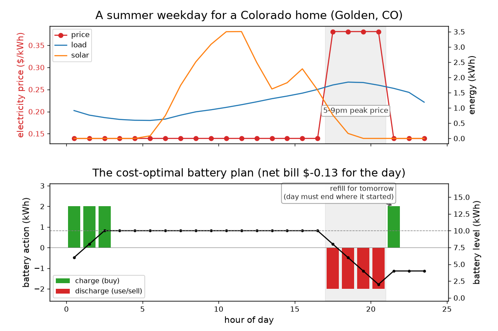
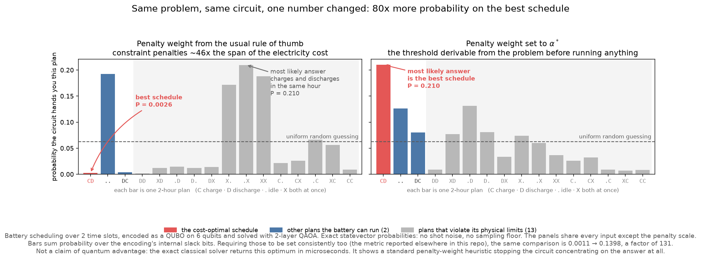
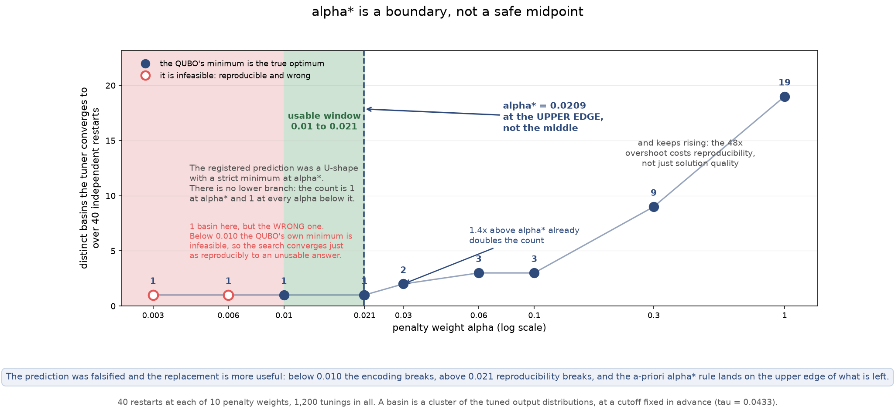
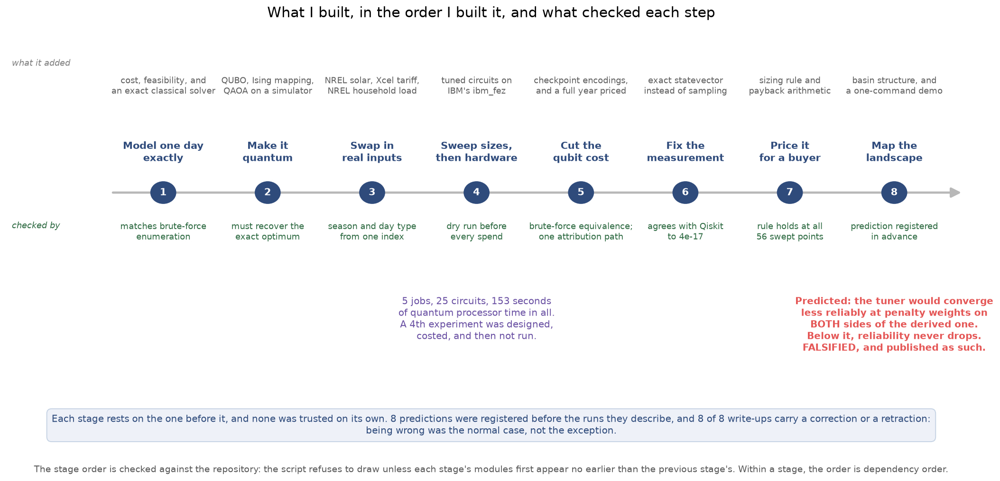
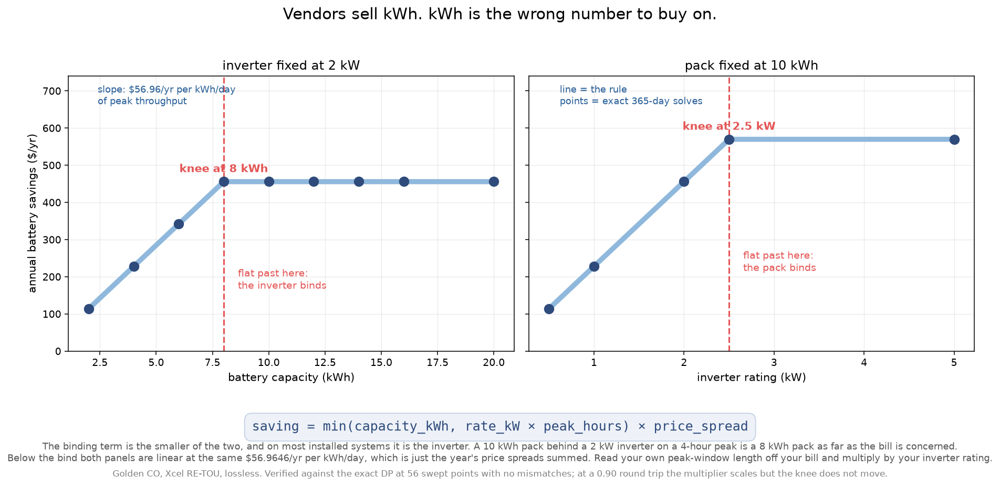
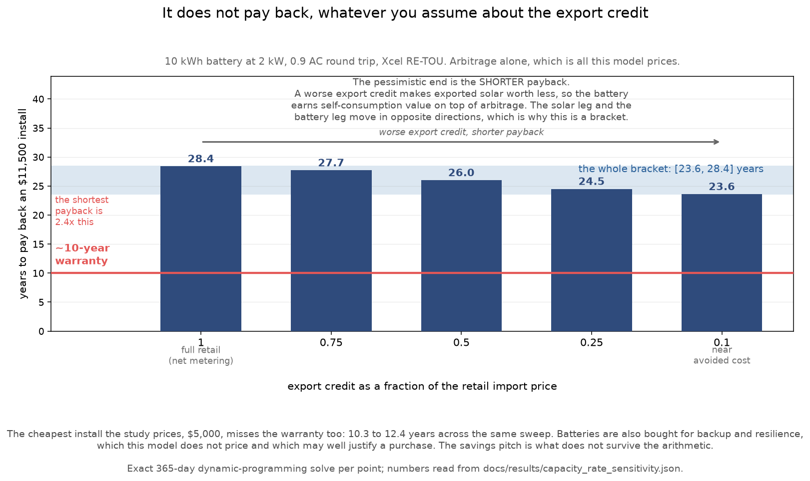
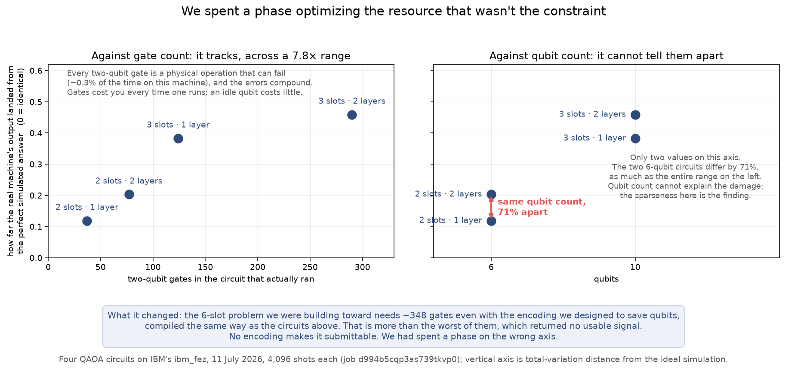
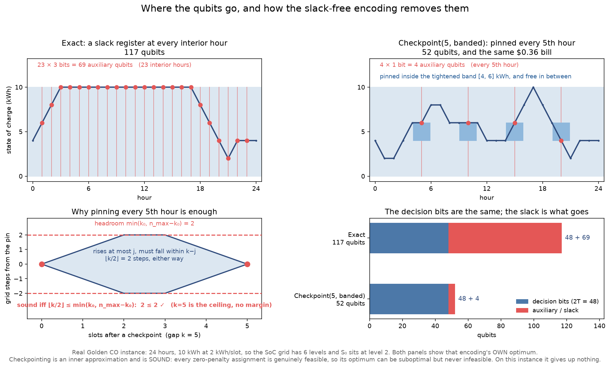

# quantum-solar

[](https://github.com/austinamissah/quantum-solar/actions/workflows/tests.yml)
[](https://doi.org/10.5281/zenodo.22105805)

A home battery in Golden, Colorado saves $456 a year under Xcel's Colorado
RE-TOU tariff, and that number has a closed form: 8 kWh of peak-hour discharge,
times each season's peak/off-peak price spread, summed over the year's 261
weekdays. I built an exact classical optimizer to confirm it on all 365 days.
The quantum half asked two questions: is the QUBO encoding of this problem
correct (proved sound, and checked against exhaustive enumeration at 2 to 4
slots and the exact DP at every size), and can the circuit run on today's
hardware (no: the 6-slot circuit needs 348 two-qubit gates, and at 290 almost
no signal survived).

The rest of this README is the technical version.

Quantum optimization of **residential battery charge/discharge scheduling under
time-of-use electricity pricing**.

Given a day split into `T` time slots — each with a solar generation, household
load, and electricity price — decide when a home battery should charge, discharge,
or idle to minimize the electricity bill, subject to the battery's capacity and a
return-to-initial state-of-charge constraint. The schedule is expressed as a QUBO
and solved with QAOA on the Qiskit Aer simulator, verified against exact classical
baselines.

> **New to quantum computing, or here to learn rather than to use the code?**
> Start with **[docs/LESSONS.md](docs/LESSONS.md)** — a standalone field report on
> what went wrong in this project and what each mistake cost, with the numbers. It
> assumes no knowledge of this repo. Topics include why a penalty weight 48x too
> large made QAOA optimize the wrong thing, why I spent a phase optimizing qubit
> count when gate count was the binding constraint, and why a variance estimate
> from two samples cannot decide anything.

## Example schedule

One real summer weekday for a 5 kW PV + 10 kWh battery home in Golden, Colorado.
Every input is real and season-coherent: NREL PVWatts solar, Xcel's Colorado RE-TOU
time-of-use price, and an NREL ResStock household load profile (see
[Real data](#real-data)). The battery drains through the whole 5–9pm peak, selling
at $0.381/kWh what it buys back at $0.139/kWh, and returns to its starting level by
midnight. The day's bill is **$0.36 against $2.29** with the battery sitting idle —
**$1.93 saved**.



**Read the peak window, not the individual bars.** Only the four discharge hours
are forced: **2,448 minimal-cost plans tie** on this day, and every one of them
discharges across the whole 5–9pm window. The specific charging hours drawn here
are one of those ties — `dp_solve`'s tie-break is fixed (minimum cost, then fewest
battery actions), so the plan is reproducible rather than canonical, and
`optima_census().forced()` is what to report rather than the raw hour list. The
lone green bar just after the peak is forced in kind but not in placement: the day
must end where it started, so a refill must happen, and every post-peak hour is
priced the same.

**Charging follows the price, not the solar.** Under net metering the optimal plan
provably depends on the price curve alone — it is unchanged by zero solar, triple
solar, flat load, or random load; only the bill moves. This is not advice to
"charge on surplus solar". See [`docs/ARCHITECTURE.md`](docs/ARCHITECTURE.md) for the
derivation and the one assumption that breaks it.

*Regenerate with `python scripts/make_real_schedule_figure.py`.*

## Pipeline

```
BatteryProblem ──build_qubo──▶ QUBO ──qubo_to_ising──▶ Ising H ──▶ QAOASolver ──▶ schedule
      │                          │                                                   ▲
      │                          └──▶ brute_force_solve (exact, tiny T) ─────────────┤ verify
      └──────────────────────────────▶ dp_solve (exact, polynomial, any T) ──────────┘
```

1. **`BatteryProblem`** owns the true objective (net-metered grid cost) and the
   hard constraints: no simultaneous charge/discharge, state of charge within
   `[0, Q]`, and `S_T = S_0`.
2. **`build_qubo`** folds the linear cost objective and the constraints into a
   QUBO. The state-of-charge inequality `0 ≤ S_t ≤ Q` is encoded **exactly** with
   a bounded binary *slack* variable per interior slot — `(S_t − s_t)²` is zero
   iff the SoC is in band. This is exact (so brute force stays a valid ground
   truth) at the cost of extra qubits.
3. **`qubo_to_ising`** maps the QUBO to a Qiskit `SparsePauliOp` cost Hamiltonian,
   with the invariant `⟨x|H|x⟩ + constant == qubo.energy(x)`.
4. **`QAOASolver`** runs QAOA on Aer (multi-start COBYLA over the variational
   parameters) and samples the best schedule.
5. **Verification.** `brute_force_solve` enumerates the QUBO exactly on tiny
   instances (validating the encoding); `dp_solve` is an exact `O(T·K·3)` dynamic
   program over the SoC grid that scales to a full day and serves as ground truth
   at larger `T`. Tests assert QAOA recovers the exact optimum.

**Round-trip losses** (`charge_efficiency`/`discharge_efficiency`), **export
credited below import** (`sell_price`), and **asymmetric charge/discharge rates**
(`charge_energy != discharge_energy`) are all modeled. Each defaults to the
simple case — lossless, net-metered, symmetric — so the defaults reproduce the
original model exactly. Asymmetric rates refine the state-of-charge grid to the
GCD of the two energy quanta rather than breaking it; incommensurate rates have no
finite grid and are rejected outright.

## How the simulator works

QAOA runs on Aer, which imitates a quantum computer by tracking the circuit's full
statevector: the n-qubit state is an array of 2^n complex amplitudes, each gate is
a matrix operation on that array, interference is those complex amplitudes
canceling or reinforcing, and a measurement draws an outcome with probability equal
to its amplitude squared. Every added qubit doubles the array, so exact statevector
simulation runs out of memory around 30 qubits on ordinary hardware. This project's
largest simulated instance is 22 qubits, about four million amplitudes (2^22), and
that exponential cost is why the largest (6-slot) QAOA runs take minutes while the
exact classical DP finishes in microseconds. The simulated qubits are ideal and
noise-free, which is why the ideal-simulator and real-hardware (`ibm_fez`) results
in the hardware comparison differ; the qubit counts here are physical circuit
qubits, with no error correction.

Qiskit and Aer are IBM's open-source quantum framework, a C++ simulation core with
a Python interface under active development, which is also why the hardware script
uses a saved account rather than the legacy `channel="ibm_quantum"` retired in the
2025 platform migration (see the Hardware section).

## The findings

Three things have to be right before QAOA works on a constrained problem: the
**encoding** has to be sound, the **penalty weight** has to be scaled, and the rule
that **selects a tuning** has to track what is actually wanted. Each failure is
invisible in the metric one would naturally watch.

> **[`docs/FINDINGS.md`](docs/FINDINGS.md) says which of the three is new and which
> are rediscoveries**, with the prior art, and points at the test behind each number.
> Short version: the **soundness guarantee** on the checkpoint encoding is the part
> that appears not to exist elsewhere — removing slack variables is a crowded field,
> but the published alternatives bias toward feasibility rather than guaranteeing it.
> The penalty-weight rule and the selection rule below are **known ideas**; what is
> mine is measuring what they cost on a real instance.

That document is the place to start for judging the work. The rest of this section
is the penalty-weight result, the most self-contained of the three.

### The penalty weight

The penalty weight — how hard the QUBO pushes the optimizer to respect the
battery's physical limits — is usually set by a rule of thumb, ~10× the objective's
scale. That is fine for a classical solver, where any infeasible answer loses
outright. It is not fine for QAOA, which minimizes an *expectation* over
everything the quantum state contains: at ~46–48× the span of the actual
electricity cost on these instances, the cost we care about is a rounding error
inside `⟨H⟩`, and the optimizer minimizes the penalty term almost to the
exclusion of the cost.



Same problem, same encoding, same circuit, same optimizer, same seed — only the
penalty scale differs. At the rule-of-thumb weight the single most likely output is
a plan that **charges and discharges in the same hour**, which no battery can do.
Rescaled to `α*`, the best schedule becomes the most likely output instead: **80×
more probability** on it (**131×** on the exact minimum-energy state, the metric
reported elsewhere here).

The threshold is derivable before running anything:

> **α\* = (objective span across feasible solutions) / (penalty scale)**

It is per-instance: 0.3095 / 14.81 = **0.0209** on the instance
[`docs/LESSONS.md`](docs/LESSONS.md) §1 works through, 0.0217 on the one drawn
above. And it is a **boundary, not a safe midpoint**:



That study was **pre-registered and its prediction was falsified**. It predicted a
U-shape in basin count with a strict minimum at α\*; there is no lower branch, and
the count is 1 at α\* and 1 at every α below. The mechanism posited for the lower
branch is real but invisible to this metric — below α\* the tuner converges *just as
reproducibly*, to a single **wrong** basin, because the QUBO's own minimum is
infeasible there. What replaced the prediction: the usable window is
`0.010 ≤ α ≤ 0.021`, α\* sits at its **upper edge**, and 1.4× above it the
basin count already doubles. Read basin count without the exactness column and
the left half of that plot looks fine. Regenerate with
`python scripts/make_basin_figure.py`; full account in
[`docs/results/basin-structure.md`](docs/results/basin-structure.md).

This is not a claim of quantum advantage — `dp_solve` returns the exact optimum for
these instances in microseconds. It is a claim about a trap that applies to any
constrained problem handed to a variational quantum algorithm, and it is the finding
that generalizes past this project. Regenerate with
`python scripts/make_penalty_weight_figure.py`; the full account is
[`docs/LESSONS.md`](docs/LESSONS.md) §1.

## Installation

```bash
git clone https://github.com/austinamissah/quantum-solar.git
cd quantum-solar
python -m venv .venv && source .venv/bin/activate
pip install -r requirements.txt   # qiskit, qiskit-aer, numpy, scipy, matplotlib, jupyter, pytest
pip install -e . --no-deps        # install the quantum_solar package (src layout)
```

The exact **classical** solvers — `dp_solve`, `brute_force_solve`, `build_qubo`,
`annual_savings` — need only **numpy**. `quantum_solar` defers its qiskit imports,
so `import quantum_solar` pulls in no quantum stack and those solvers run without
one; qiskit loads on first use of `QAOASolver` or `qubo_to_ising`. The install
above is the supported path and gives you everything.

## Run the demo

```bash
python -m quantum_solar
```

One command, **no network, no API key, no notebook** — it runs on data committed
to this repository (the annual PVWatts/URDB snapshot and the packaged ResStock load
profiles), and needs nothing beyond numpy. It prints one real Colorado day's optimal
plan with its forced hours separated from its 2,448 ties, the exact 365-day
three-way savings split, the sizing rule, and the payback arithmetic:

```
  hour       0  3  6  9  12 15 18 21
  price      ▁▁▁▁▁▁▁▁▁▁▁▁▁▁▁▁▁████▁▁▁   $0.139 … $0.381/kWh
  plan       CCC··············DDDDC··   C charge · D discharge · · idle
  level      ▅▇███████████████▇▅▄▂▄▄▄   0 … 10 kWh

  bill $0.36   ·   idle battery $2.29   ·   battery saves $1.93
```

Turn the knobs that matter — nothing is interpolated or cached, every figure is
recomputed exactly (~2.5 s for the full run, ~0.1 s with `--day-only`):

```bash
python -m quantum_solar --round-trip 0.90 --export-ratio 0.25   # realistic, not the defaults
python -m quantum_solar --capacity 20 --rate 5                  # sizing
python -m quantum_solar --day 17 --day-only                     # a winter weekday
python -m quantum_solar --quantum                               # QAOA vs the exact solvers
```

The dollar figures come from the same `annual_from_inputs` call this README quotes,
and `tests/test_cli.py` pins them against the table above, so the two cannot drift.

For the quantum half and the plots, the notebook goes further:

```bash
jupyter lab notebooks/demo.ipynb
```

It builds a small instance, solves it with brute force, DP, and QAOA (showing they
agree), then plots the optimal schedule for a full day. Its real-data cells need an
`NREL_API_KEY`; `python -m quantum_solar` does not.

## Documentation

- [`docs/FINDINGS.md`](docs/FINDINGS.md) — **what is actually new here and what is
  not**, positioned against the published literature, with the test behind every
  number. Read this before citing anything.
- [`docs/ARCHITECTURE.md`](docs/ARCHITECTURE.md) — how the pipeline fits together,
  the invariants that are easy to break, data provenance, and conventions. Start
  here before changing anything.
- [`docs/LESSONS.md`](docs/LESSONS.md) — a standalone field report on what went
  wrong in this project and what each mistake cost. Readable on its own.
- `docs/plans/` — pre-registrations, written before the runs they describe.
  `docs/results/` — the corresponding write-ups, including the retractions.



The build order, and what was put in place to catch each stage being wrong. Each
stage rests on the one before it and none was trusted on its own: the classical
solver is checked against brute-force enumeration, QAOA against the exact optimum,
the encodings against brute force again, the fast statevector against Qiskit, the
sizing rule at all 56 swept points. Fourteen predictions were registered before the
runs they describe, four write-ups report one of them falsified, nine of fifteen
carry a correction or a retraction, and one hardware experiment was designed,
costed, and then not run. The stage order is not asserted:
`scripts/make_process_figure.py` refuses to draw unless each stage's modules first
appear in the repository no earlier than the previous stage's, so a tidier story
than the one that happened fails instead of printing.

## Hardware (IBM Quantum)

Running the tuned QAOA circuits on real hardware uses an extra dependency, kept
out of the main requirements:

```bash
pip install -r requirements-hardware.txt   # qiskit-ibm-runtime (hardware only)
```

`scripts/experiment_hardware.py` has three separated stages:

```bash
python scripts/experiment_hardware.py optimize   # (a) simulator: tune angles -> hardware_params.json
python scripts/experiment_hardware.py submit     # (b) DRY RUN: prints backend/circuits/shots/est. QPU s
python scripts/experiment_hardware.py submit --yes-spend-qpu   # actually samples (SamplerV2, 4096 shots)
```

Stage (b) only ever runs sampling (never optimization) on hardware, is a dry run
unless `--yes-spend-qpu` is given, and records the actual QPU seconds from job
metadata. Auth uses a saved account: run `QiskitRuntimeService.save_account(...)`
once (stored in `~/.qiskit`); the script uses a bare `QiskitRuntimeService()` —
**not** the legacy `channel="ibm_quantum"` (sunset in the 2025 migration).
`notebooks/experiment_hardware.ipynb` compares exact vs ideal-simulated vs
hardware distributions (TVD, optimal mass, feasibility).

## Tests

```bash
pytest -m "not slow"   # fast unit tests (model, QUBO, Ising, brute force, DP)
pytest                 # full suite, including the slow Aer-backed QAOA runs
```

CI runs the fast suite on every push and pull request; a weekly scheduled job
runs the full suite including the slow quantum tests.

## Real data

Solar generation can be pulled from the NREL PVWatts API instead of the synthetic
generator:

```python
from quantum_solar.data import load_nrel_instance

problem = load_nrel_instance(lat=39.74, lon=-105.18, day=172)  # 24 hourly slots
```

Set `NREL_API_KEY` in your environment or a repo-root `.env` (a free key comes
from developer.nlr.gov). Responses are cached under `data/cache/`. **All three
inputs are real and season-coherent:** the day-of-year `day` drives every axis —
solar generation (NREL PVWatts), time-of-use price (Xcel Energy CO *Residential
Energy TOU*, Schedule RE-TOU, via URDB) for that day's month and weekday/weekend
schedule, and household load (NREL ResStock representative Colorado
single-family-detached profile) for that day's season × weekday/weekend bucket
(see `src/quantum_solar/data/profiles/SOURCE.md`). Season and day type can no
longer silently disagree — a winter day pulls a winter price and a winter load,
not a summer one. The demo notebook reports a three-way dollar-savings comparison
(no system / solar-only / solar + optimal battery) for a single day.

### Annualized savings

`annual_savings` runs the exact DP over a full calendar year and reports the
**three-way counterfactual split**, so each contribution is attributable on its
own — the battery number is never conflated with the solar number:

```python
from quantum_solar import annual_savings

result = annual_savings(lat=39.74, lon=-105.18)   # 365 exact DP solves, ~0.1 s
result.battery_savings                            # $/yr from the battery alone
```

For a **5 kW PV + 10 kWh battery in Golden, CO**, priced against the **Xcel
RE-TOU** tariff (URDB label `69bd927af5cd25efec0e9aad`, snapshot as of **August
2026**):

| Counterfactual | Annual bill |
| --- | --- |
| No system (`price × load`) | **$1747.83** |
| Solar only (battery idle, `price × (load − generation)`) | **$777.22** |
| Solar + optimal battery | **$321.50** |

- **Solar savings ≈ $970.61/yr.** *Net-metering caveat:* under a single buy = sell
  price every exported kWh credits at **full retail**, which is what makes this
  figure achievable. Real export credits sit **below** retail, and this leg is the
  one that suffers: pass `export_ratio=` to price it. At a quarter of retail it
  falls to **$636.05/yr**, and at near avoided-cost to **$569.14/yr** — a ~40% cut.
- **Battery savings ≈ $455.72/yr — the battery alone** (solar held fixed across
  the comparison). This figure is comparatively **robust** to the net-metering
  assumption: arbitrage depends on the on/off-peak *spread*, not the export price.
  It is a **lossless, net-metered** figure — the table above uses the library
  defaults. At a realistic **0.90 AC round trip** it falls ~11% to **$404.28/yr**.
  A *worse* export credit moves it the other way, up to **$486.94/yr** near
  avoided-cost, because a poor credit gives the battery self-consumption value on
  top of arbitrage. The two legs move in opposite directions, which is exactly why
  the split reports them separately. See
  [`docs/results/capacity-rate-sensitivity.md`](docs/results/capacity-rate-sensitivity.md).

The dollar amounts are a tariff snapshot. On August 20, 2026 Colorado's PUC
approved a **$157 million** Xcel increase (proceeding
[25AL-0494E](https://puc.colorado.gov/electric-rate-cases)), roughly half the
~$356 million originally filed: about **$5 a month** on an average residential
bill, $104.91 to $109.92 at 601 kWh. Those rates **take effect at the end of
December 2026**, so the figures here still match what is billed today, and the
URDB label pins the version tested against. Weekends contribute **$0** battery
savings: the RE-TOU weekend schedule is flat off-peak, so there is no spread to
arbitrage.

### Sizing and payback

[`docs/results/capacity-rate-sensitivity.md`](docs/results/capacity-rate-sensitivity.md)
turns that annual figure into the two things a buyer needs.

**What size actually earns.** Every optimal schedule discharges through the whole
peak window and nothing else is forced, so only the energy the inverter can push
out *inside* that window can pay:

```
saving = min(capacity_kWh, rate_kW × peak_hours) × price_spread
```



Sweep the capacity behind a fixed 2 kW inverter and the curve goes flat at 8 kWh:
past that the inverter cannot push the extra energy out inside the peak window, so
it is never discharged at the high price. Sweep the rating behind a fixed 10 kWh
pack and it goes flat at 2.5 kW, where `2.5 × 4 h` finally equals the pack and the
capacity binds instead. The line is the rule; the points are exact 365-day solves.
Regenerate with `python scripts/make_sizing_figure.py`.

Verified against the exact DP at every swept point, on the real tariff and on
synthetic ones at 3–6 peak hours (56 points, no mismatches) — so read your own
peak-window length off your bill and multiply by your inverter rating. A 10 kWh
pack behind a 2 kW inverter on a 4-hour peak is an **8 kWh pack** as far as the
bill is concerned. Consequently **rate is the axis that pays**: at the same 0.90
round trip the payback below uses, 2 kW → 2.5 kW is worth **+$101.07/yr**, while
10 kWh → 20 kWh is worth **$0.00/yr**. (Losslessly those are +$113.93 and $0.00 —
losses scale the multiplier and leave the knee, and the asymmetry, where they are.)

Both of those figures are multiples of a single constant: **$56.96/yr per kWh/day
of peak-window throughput** (lossless), which is the year's price spreads
added up — 86 summer weekdays at $0.242, 175 winter weekdays at $0.207, and 104
weekends at $0. Annual value is *exactly* linear in delivered peak energy below the
knee, so a 2 kWh/day step is worth $113.93/yr wherever it comes from. That is why
the same figure turns up again as the cost of the last four qubits in
[`docs/results/slack-free-encoding.md`](docs/results/slack-free-encoding.md) — both
are 2 kWh/day steps, computed by different code paths. It is an identity, not a
transcription.

**Whether it pays back — it does not.** At a **0.90 AC round trip**, a ~$11,500
install pays back in **~28 years** against a ~10-year warranty ($9,000 → 22 yr,
$7,000 → 17 yr). Sweeping the export credit from full retail down to avoided cost
brackets that at **[23.6, 28.4] years** — a worse credit *helps* the battery, and
still falls far short. **On a two-tier tariff, arbitrage alone does not pay for the
hardware within its warranted life**, and that conclusion no longer rests on any
optimistic assumption: both have been priced and swept. Batteries are also bought
for backup and resilience, which this model does not price and which may well
justify a purchase — but the arithmetic does not support the savings case.



The export credit is the one input a reader is most likely to argue with — it is
jurisdiction-specific and cannot be verified from the committed snapshot — so it is
swept end to end rather than assumed. Every point on that sweep clears the warranty
line, so **the conclusion does not depend on which assumption you believe**. Note
the direction: the *pessimistic* end gives the *shorter* payback, because a worse
export credit hands the battery self-consumption value on top of arbitrage. That is
why this is a bracket rather than a point estimate, and why the solar and battery
legs must never be summed. Regenerate with `python scripts/make_payback_figure.py`.

## Status

The pipeline runs end to end: problem model, exact QUBO encoding, Ising mapping,
QAOA on the Aer simulator, and both classical baselines, all covered by tests. It
is no longer simulation-only. The real-data path uses real inputs throughout (NREL
PVWatts generation, Xcel URDB price, NREL ResStock load, all Colorado-coherent),
and the tuned QAOA circuits have run on real IBM Quantum hardware.

### Results on hardware

On July 11, 2026 the four smallest tuned circuits (2 and 3 time slots, 1 and 2
QAOA layers) ran on `ibm_fez`, a 156-qubit processor, using 7 seconds of QPU time
with 4096 shots per circuit via SamplerV2. Noise grew steadily with circuit size:
the total-variation distance from the ideal simulation rose from 0.12 to 0.46 as
the transpiled two-qubit gate count grew from 37 to 290. Only the smallest circuit
kept a signal clearly above random guessing; the other three fell to the
measurement floor, where noise dominates. The pre-registered prediction that
shallower circuits would survive noise better did not cleanly hold: it flipped with
size, because near the floor the ordering reflected how well each circuit was tuned
rather than its depth. The full analysis is in
`notebooks/experiment_hardware.ipynb`, and the run was pre-registered in
`docs/plans/hardware-run.md`.

Those four circuits also settled which resource limits this project. It is gate
count, not the qubit count the first phase had gone into optimizing:



Everyone counts qubits, and an encoding phase here cut a 6-slot problem from 22
qubits to 12. But degradation tracks **two-qubit gate count** monotonically across a
7.8× range, while **qubit count takes two values and explains nothing** — the two
circuits sharing 6 qubits differ by 71%, as wide as the whole trend. Gates cost
because each one is a physical operation with an error rate (~0.3% median on this
device) and errors compound; an idle qubit costs comparatively little.

That reordered the project. The 6-slot target needs ~348 gates *even with* the
qubit-saving encoding, compiled the way those circuits were — more than the worst
of them (3 slots, 2 layers, 290 gates), which had already returned almost no
usable signal. (At the more aggressive `optimization_level=3` the pair is 269
against 237; the gap holds either way, but the two settings must not be mixed.)
**No encoding makes it submittable**, and fifteen minutes with data already in hand
would have said so. Regenerate with
`python scripts/make_gates_vs_qubits_figure.py`; the account is
[`docs/LESSONS.md`](docs/LESSONS.md) §2.

Three further runs followed on August 3, 2026, all on `ibm_fez` and all
pre-registered: the **slack-free encoding** against the exact encoding with and
without error mitigation, a **replication** of the encoding gap with a
default-weight control, and a **10-replicate spread** measurement sized so its
`RESOLVED` verdict was actually reachable.

A fourth question followed on August 25, 2026, also pre-registered: **does depth
help, net of noise?** `cp3` ran at reps 1 and 2 in one job, the first circuit small
enough to fit both depths inside the coherence budget and so the first that could
answer it. **The registered prediction was falsified.** The depolarizing model
fitted to the July circuits said the deeper arm's ideal 1.93x advantage would be
exactly cancelled by 2.4x the two-qubit gates; instead hardware optimal mass rose
**+0.03613** against a threshold of 0.00765, and both depths retained the same
fraction of their ideal.

**It replicated, and its stated mechanism did not.** The plan required replication
before this outcome counted as more than one job, so the identical circuits flew
again the next day in a fresh calibration window: the difference came back at
**+0.03027** and **+0.03394**, against +0.03613 and +0.03320 the first time. The
effect is real on this instance and this device. But the first run's explanation
for it, that both depths retain the same fraction of their ideal, **did not
survive** the second run and is withdrawn in place. What survives is weaker and
sufficient: the deeper circuit degrades more, by an amount that varies between
runs, and by less than its 1.93x ideal advantage. See
[`docs/results/hardware-run-depth.md`](docs/results/hardware-run-depth.md) and
[its replication](docs/results/hardware-run-depth-replication.md).

**In total: 7 jobs, 33 circuits, 565,248 shots, 165 seconds of QPU time.** Every
number in every hardware write-up traces to one of those job IDs, listed with
backend, date, shot count and device calibration in
[`docs/results/hardware-jobs.md`](docs/results/hardware-jobs.md) (generated from
the raw result files by `scripts/hardware_jobs.py`, so it cannot drift from them).

The total is small because a planned 10-hour run was **declined**: by then the
metric had already bottomed out two problem sizes earlier and the run would have
returned nine zeros — see `docs/LESSONS.md`.

## Roadmap

- ~~Annualized savings.~~ **Done.** `annual_savings` sweeps all **365 days
  exactly** (not representative-day sampling): PVWatts generation is fetched
  once and cached and the DP is microseconds per day, so an exact full-year
  total is cheaper to compute than a weighted representative-day estimate and
  needs no weighting scheme. Reports the three-way split above.
- ~~Relax the v1 modeling assumptions: asymmetric buy/sell prices and round-trip
  efficiency.~~ **Done**, along with asymmetric charge/discharge rates, which was
  not on this list. All three default to the original behavior, so the lossless
  net-metered figures above reproduce exactly. The prediction in this item held for
  the export credit: it is the **solar** leg that suffers, ~40% down from
  **$970.61/yr** to **$569.14/yr** near avoided-cost, while the battery leg is
  robust to it and in fact moves the other way, since a poor credit adds
  self-consumption value on top of arbitrage. Round-trip losses are the separate
  cost, and they do reach the battery leg: ~11% down to **$404.28/yr** at a 0.90 AC
  round trip. Both legs are quoted under
  [Annualized savings](#annualized-savings) and priced in
  [`docs/results/capacity-rate-sensitivity.md`](docs/results/capacity-rate-sensitivity.md).
- ~~Scaling study: slack-free approximate encodings vs. the exact one.~~ **Done.**
  A *sound* checkpoint encoding (`Encoding.checkpoint(k, banded=True)`) captures
  the full $455.72/yr battery value at **52 qubits** against the exact encoding's
  **117**, priced through the real 365-day instance. The study also found that
  `default_weights` overshoots the objective span by ~48x, which is the dominant
  limit on QAOA concentration; the a-priori fix is **alpha* = span/penalty =
  0.0209**. See `docs/results/slack-free-encoding.md`.

  

  Where those qubits go: a QUBO expresses equalities natively but not
  inequalities, so the exact encoding buys each `0 ≤ S_t ≤ Q` with a bounded
  binary slack register at **every interior hour** — 23 hours × 3 bits = 69
  auxiliary qubits on top of the 48 decision bits. Checkpointing pins the state of
  charge only every 5th hour, inside a *tightened* band, and lets the path do what
  it likes in between: 4 checkpoints × 1 bit = **4** auxiliary qubits, for the same
  daily bill by a different route. It is **sound** — between two slots pinned `k`
  apart the trajectory rises at most `j` steps and must fall within the remaining
  `k−j`, so the excursion is bounded by `⌊k/2⌋`, and pinning every `k`-th slot
  keeps the whole path in band whenever `⌊k/2⌋ ≤ min(k₀, n_max−k₀)`. Here that is
  `2 ≤ 2`: `k=5` is exactly `max_sound_spacing` on this instance, with no margin.
  Every zero-penalty assignment is therefore genuinely feasible, so this encoding's
  optimum can be suboptimal but never *infeasible* — which the unsound alternatives
  in `encodings.py` cannot promise. Regenerate with
  `python scripts/make_encoding_figure.py`.

  Measured exactly rather than by sampling, that fix is worth **4–20x uniform
  random at every size tested (T=2..5), with no decay as the problem grows** —
  against roughly parity, collapsing at T=5, at the default weight. An earlier
  chart concluded there was "no measurable quantum advantage as the problem scales
  up"; that was an artifact of a metric that reads zero below one part in 4096
  combined with the mis-scaled weight, and is retracted. The bar is a low one —
  `dp_solve` returns the exact optimum for every one of these instances in
  microseconds — so this measures concentration, not advantage. Figure:
  `docs/figures/web/mass_ratio_exact.png`. See `docs/results/eval-censoring.md`.
- ~~A reps=2 checkpoint circuit on hardware.~~ **Done**, on 2026-08-25: `cp3` at
  reps 1 and 2 in one job on `ibm_fez`, 112 two-qubit gates at the deeper arm, 6.0
  QPU seconds. It answers **H1** — does depth help, net of noise? — which the July
  run defined and never submitted, and which T=4 and T=6 were ruled out for because
  a circuit that can only run one depth cannot answer a question about depth.
  **The registered prediction was falsified**: the depolarizing model said the
  ideal 1.93x gain would be exactly cancelled by 2.4x the gates; instead optimal
  mass rose **+0.03613**, against a threshold of 0.00765, with both depths
  retaining the same fraction of their ideal. **Replicated the next day** in a
  fresh calibration window (+0.03027, +0.03394), which is what that run's plan
  required; the equal-retention *mechanism* did not replicate and is withdrawn in
  place. See [`docs/results/hardware-run-depth.md`](docs/results/hardware-run-depth.md)
  and [its replication](docs/results/hardware-run-depth-replication.md).

Open:

- Bill US federal holidays off-peak instead of as ordinary weekdays. URDB carries
  no holiday schedule and ResStock's weekday aggregate folds holidays in, so both
  the price and the load side currently treat them as weekdays, while under this
  tariff most of them bill off-peak like a weekend. **11 weekday holidays** in AMY
  2018 are affected, and the annual figure overstates battery arbitrage on each,
  because the model sees an on/off-peak spread the real tariff does not charge.
  `is_federal_holiday` already identifies them, rule-derived rather than
  hardcoded, and is not wired into the annual loop. This is the last thing in the
  repository still carrying the v1 label (`src/quantum_solar/data/calendar.py`).
- Whether `max_sound_spacing` is tight. The soundness condition is proved
  *sufficient* and the guard enforces it, but nothing here shows that a spacing one
  step past it admits an infeasible zero-penalty assignment: the guard refuses to
  construct that encoding, so necessity cannot be probed without deliberately
  bypassing it. The published claim is sufficiency and stands either way; what is
  open is whether the bound gives up qubit savings that are actually sound.

## Citation

Each release is archived on Zenodo. The **concept DOI**
[`10.5281/zenodo.22105805`](https://doi.org/10.5281/zenodo.22105805) resolves to the
newest version, and each release also carries its own version DOI, listed on the
Zenodo record. `CITATION.cff` at the repository root holds the metadata, and both the
Zenodo record and GitHub's "Cite this repository" button are built from it.

> Amissah, A. (2026). *quantum-solar: an exactly-solved battery-scheduling instance
> for QAOA method work, with a slack-free encoding* (v1.0.2). Zenodo.
> https://doi.org/10.5281/zenodo.22105805

[`docs/FINDINGS.md`](docs/FINDINGS.md) separates what appears to be new here from what
is a rediscovery of published work, along with the prior-art scan behind that split
and its limits.

## How this work gets made

Built with help from an AI assistant, Claude Code: it wrote and debugged much of the
code, ran the prior-art searches, and helped draft the docs. The experiments, the
registered predictions, the claims and their strength, and any errors are mine.
Working method: https://amissah.net/about#how-its-made
