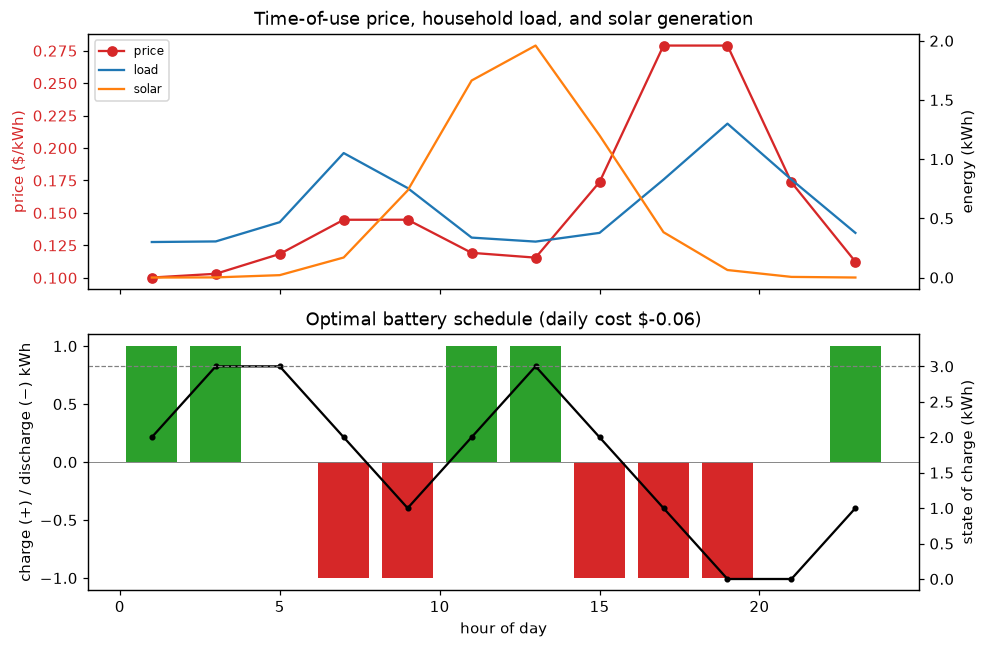

# quantum-solar

[](https://github.com/austinamissah/quantum-solar/actions/workflows/tests.yml)

Quantum optimization of **residential battery charge/discharge scheduling under
time-of-use electricity pricing**.

Given a day split into `T` time slots — each with a solar generation, household
load, and electricity price — decide when a home battery should charge, discharge,
or idle to minimize the electricity bill, subject to the battery's capacity and a
return-to-initial state-of-charge constraint. The schedule is expressed as a QUBO
and solved with QAOA on the Qiskit Aer simulator, verified against exact classical
baselines.

> **New to quantum computing, or here to learn rather than to use the code?**
> Start with **[docs/LESSONS.md](docs/LESSONS.md)** — a standalone field report on
> what went wrong in this project and what each mistake cost, with the numbers. It
> assumes no knowledge of this repo. Topics include why a penalty weight 48x too
> large made QAOA optimize the wrong thing, why we spent a phase optimizing qubit
> count when gate count was the binding constraint, and why a variance estimate
> from two samples cannot decide anything.

## Example schedule

The optimizer charges when energy is cheap (overnight and midday, when solar is
abundant) and discharges into the morning and evening price peaks, while keeping
the state of charge within capacity and returning it to its starting level:



*(Illustrative synthetic day; regenerate with `python scripts/make_preview.py`. See
[Real data](#real-data) for using real NREL solar generation.)*

## Pipeline

```
BatteryProblem ──build_qubo──▶ QUBO ──qubo_to_ising──▶ Ising H ──▶ QAOASolver ──▶ schedule
      │                          │                                                   ▲
      │                          └──▶ brute_force_solve (exact, tiny T) ─────────────┤ verify
      └──────────────────────────────▶ dp_solve (exact, polynomial, any T) ──────────┘
```

1. **`BatteryProblem`** owns the true objective (net-metered grid cost) and the
   hard constraints: no simultaneous charge/discharge, state of charge within
   `[0, Q]`, and `S_T = S_0`.
2. **`build_qubo`** folds the linear cost objective and the constraints into a
   QUBO. The state-of-charge inequality `0 ≤ S_t ≤ Q` is encoded **exactly** with
   a bounded binary *slack* variable per interior slot — `(S_t − s_t)²` is zero
   iff the SoC is in band. This is exact (so brute force stays a valid ground
   truth) at the cost of extra qubits.
3. **`qubo_to_ising`** maps the QUBO to a Qiskit `SparsePauliOp` cost Hamiltonian,
   with the invariant `⟨x|H|x⟩ + constant == qubo.energy(x)`.
4. **`QAOASolver`** runs QAOA on Aer (multi-start COBYLA over the variational
   parameters) and samples the best schedule.
5. **Verification.** `brute_force_solve` enumerates the QUBO exactly on tiny
   instances (validating the encoding); `dp_solve` is an exact `O(T·K·3)` dynamic
   program over the SoC grid that scales to a full day and serves as ground truth
   at larger `T`. Tests assert QAOA recovers the exact optimum.

v1 modeling assumptions: net metering (a single buy=sell price) and a lossless
battery with equal charge/discharge energy per slot. Asymmetric pricing and
round-trip losses are on the roadmap.

## How the simulator works

QAOA runs on Aer, which imitates a quantum computer by tracking the circuit's full
statevector: the n-qubit state is an array of 2^n complex amplitudes, each gate is
a matrix operation on that array, interference is those complex amplitudes
canceling or reinforcing, and a measurement draws an outcome with probability equal
to its amplitude squared. Every added qubit doubles the array, so exact statevector
simulation runs out of memory around 30 qubits on ordinary hardware. This project's
largest simulated instance is 22 qubits, about four million amplitudes (2^22), and
that exponential cost is why the largest (6-slot) QAOA runs take minutes while the
exact classical DP finishes in microseconds. The simulated qubits are ideal and
noise-free, which is why the ideal-simulator and real-hardware (`ibm_fez`) results
in the hardware comparison differ; the qubit counts here are physical circuit
qubits, with no error correction.

Qiskit and Aer are IBM's open-source quantum framework, a C++ simulation core with
a Python interface under active development, which is also why the hardware script
uses a saved account rather than the legacy `channel="ibm_quantum"` retired in the
2025 platform migration (see the Hardware section).

## Installation

```bash
git clone git@github.com:austinamissah/quantum-solar.git
cd quantum-solar
python -m venv .venv && source .venv/bin/activate
pip install -r requirements.txt   # qiskit, qiskit-aer, numpy, scipy, matplotlib, jupyter, pytest
pip install -e . --no-deps        # install the quantum_solar package (src layout)
```

## Run the demo

```bash
jupyter lab notebooks/demo.ipynb
```

The notebook builds a small instance, solves it with brute force, DP, and QAOA
(showing they agree), then plots the optimal schedule for a full day.

## Hardware (IBM Quantum)

Running the tuned QAOA circuits on real hardware uses an extra dependency, kept
out of the main requirements:

```bash
pip install -r requirements-hardware.txt   # qiskit-ibm-runtime (hardware only)
```

`scripts/experiment_hardware.py` has three separated stages:

```bash
python scripts/experiment_hardware.py optimize   # (a) simulator: tune angles -> hardware_params.json
python scripts/experiment_hardware.py submit     # (b) DRY RUN: prints backend/circuits/shots/est. QPU s
python scripts/experiment_hardware.py submit --yes-spend-qpu   # actually samples (SamplerV2, 4096 shots)
```

Stage (b) only ever runs sampling (never optimization) on hardware, is a dry run
unless `--yes-spend-qpu` is given, and records the actual QPU seconds from job
metadata. Auth uses a saved account: run `QiskitRuntimeService.save_account(...)`
once (stored in `~/.qiskit`); the script uses a bare `QiskitRuntimeService()` —
**not** the legacy `channel="ibm_quantum"` (sunset in the 2025 migration).
`notebooks/experiment_hardware.ipynb` compares exact vs ideal-simulated vs
hardware distributions (TVD, optimal mass, feasibility).

## Tests

```bash
pytest -m "not slow"   # fast unit tests (model, QUBO, Ising, brute force, DP)
pytest                 # full suite, including the slow Aer-backed QAOA runs
```

CI runs the fast suite on every push and pull request; a weekly scheduled job
runs the full suite including the slow quantum tests.

## Real data

Solar generation can be pulled from the NREL PVWatts API instead of the synthetic
generator:

```python
from quantum_solar.data import load_nrel_instance

problem = load_nrel_instance(lat=39.74, lon=-105.18, day=172)  # 24 hourly slots
```

Set `NREL_API_KEY` in your environment or a repo-root `.env` (a free key comes
from developer.nlr.gov). Responses are cached under `data/cache/`. **All three
inputs are real and season-coherent:** the day-of-year `day` drives every axis —
solar generation (NREL PVWatts), time-of-use price (Xcel Energy CO *Residential
Energy TOU*, Schedule RE-TOU, via URDB) for that day's month and weekday/weekend
schedule, and household load (NREL ResStock representative Colorado
single-family-detached profile) for that day's season × weekday/weekend bucket
(see `src/quantum_solar/data/profiles/SOURCE.md`). Season and day type can no
longer silently disagree — a winter day pulls a winter price and a winter load,
not a summer one. The demo notebook reports a three-way dollar-savings comparison
(no system / solar-only / solar + optimal battery) for a single day.

### Annualized savings

`annual_savings` runs the exact DP over a full calendar year and reports the
**three-way counterfactual split**, so each contribution is attributable on its
own — the battery number is never conflated with the solar number:

```python
from quantum_solar import annual_savings

result = annual_savings(lat=39.74, lon=-105.18)   # 365 exact DP solves, ~0.1 s
result.battery_savings                            # $/yr from the battery alone
```

For a **5 kW PV + 10 kWh battery in Golden, CO**, priced against the **Xcel
RE-TOU** tariff (URDB label `69bd927af5cd25efec0e9aad`, snapshot as of **August
2026**):

| Counterfactual | Annual bill |
| --- | --- |
| No system (`price × load`) | **$1747.83** |
| Solar only (battery idle, `price × (load − generation)`) | **$777.22** |
| Solar + optimal battery | **$321.50** |

- **Solar savings ≈ $970.61/yr.** *Net-metering caveat (v1):* under a single
  buy = sell price, every exported kWh credits at **full retail** — which is what
  makes this figure achievable. Real Colorado export credits sit **below** retail,
  so this leg would shrink under asymmetric pricing.
- **Battery savings ≈ $455.72/yr — the battery alone** (solar held fixed across
  the comparison). This figure is comparatively **robust** to the net-metering
  assumption: arbitrage depends on the on/off-peak *spread*, not the export price.

The dollar amounts are a tariff snapshot — a **~9.9% Xcel increase filed for
August 2026** will move the absolute bills (the URDB label pins the version we
test against). Weekends contribute **$0** battery savings: the RE-TOU weekend
schedule is flat off-peak, so there is no spread to arbitrage.

## Status

The pipeline runs end to end: problem model, exact QUBO encoding, Ising mapping,
QAOA on the Aer simulator, and both classical baselines, all covered by tests. It
is no longer simulation-only. The real-data path uses real inputs throughout (NREL
PVWatts generation, Xcel URDB price, NREL ResStock load, all Colorado-coherent),
and the tuned QAOA circuits have run on real IBM Quantum hardware.

### Results on hardware

On July 11, 2026 the four smallest tuned circuits (2 and 3 time slots, 1 and 2
QAOA layers) ran on `ibm_fez`, a 156-qubit processor, using 7 seconds of QPU time
with 4096 shots per circuit via SamplerV2. Noise grew steadily with circuit size:
the total-variation distance from the ideal simulation rose from 0.12 to 0.46 as
the transpiled two-qubit gate count grew from 37 to 290. Only the smallest circuit
kept a signal clearly above random guessing; the other three fell to the
measurement floor, where noise dominates. The pre-registered prediction that
shallower circuits would survive noise better did not cleanly hold: it flipped with
size, because near the floor the ordering reflected how well each circuit was tuned
rather than its depth. The full analysis is in
`notebooks/experiment_hardware.ipynb`, and the run was pre-registered in
`docs/plans/hardware-run.md`.

## Roadmap

- **Done — annualized savings.** `annual_savings` sweeps all **365 days exactly**
  (not representative-day sampling): PVWatts generation is fetched once and cached
  and the DP is microseconds per day, so an exact full-year total is cheaper to
  compute than a weighted representative-day estimate and needs no weighting
  scheme. Reports the three-way split above.
- Relax the v1 modeling assumptions: asymmetric buy/sell prices and round-trip
  efficiency. (This shrinks the solar-export leg; the battery-arbitrage leg is
  largely unaffected — see the caveat above.)
- ~~Scaling study: slack-free approximate encodings vs. the exact one.~~ **Done.**
  A *sound* checkpoint encoding (`Encoding.checkpoint(k, banded=True)`) captures
  the full $455.72/yr battery value at **52 qubits** against the exact encoding's
  **117**, priced through the real 365-day instance. The study also found that
  `default_weights` overshoots the objective span by ~48x, which is the dominant
  limit on QAOA concentration; the a-priori fix is **alpha* = span/penalty =
  0.0209**. See `docs/results/slack-free-encoding.md`.
